# BoxPad Journal

> [!Note]
> I already made a Macropad before called [SnakePad](https://github.com/Nadoooor/SnakePad), and a workshop in #horizons-equinox. So those designing hours will be kinda few, and also the journal Entrys won't have that much errors i figured out and so on.

## Entry 1
- Author: Nader
- Date: 10/7/2026

### Content

OH well, umm Iam making this project because I want to proof that anyone can start designing and building hardware. Even with very minimal things and DIYing.

So, I decided the most weird thing in my life, Iam gonna make a Cheese box Macropad. 

Yeap as you read. Umm, well iam gonna design PCB and a 3D case for that.
But, this would be like 2 ways to build this. 

* With printables.
    * PCB
    * 3D case
* Without Printables (DIYing)

and iam gonna use the second method to proof what i said above. 

Well, i started in this session with the Designing. 

Umm, i finished the whole design in one session so iam gonna make sections in this Entry.

#### Section 1 (Schematic)

Well, this was the most easy part, bro i was just finished a macropad workshop in #horizons-equinox. 

So, i literaly got all the resources already.

So, i just added the components iam gonna use, i just searched for another Xiao RP2040 symbol to use and downloaded the Xiao offical lib into kicad. 

So after adding my parts which are:

* 8 Switches
* 8 Diodes
* 1 Rotary Encoder
* 1 OLED Display
* 1 Xiao RP2040
* 1 WS2812 Symbol (Just for connections)

I started wiring the matrix first, I wired all the diodes to their Switches and then wired all the ROW switches with each others from the diodes, and wired all the column switches with each other.

So now the Diode oriantation would be COL2ROW. 

After that i added labels to the COLs and ROWs and finished the Switches matrix. 

After finishing the matrix, I proceeded to the WS2812 Neopixels.

I simply wired it to GND and 5v+ and then wired it to a single 1 NEOs label, and then connected this label to pin 6 in the xiao RP2040.

Also did that for the OLED screen, and the rotary encoder. TBH the rotary encoder i forgot how to wire it. so i searched, because i ended up with only 2 pins left for it. 

So i figured out how to wire it, and used these Pins. (THe problem was that i thought i need 3 pins and i can't use GND)

After that, I connected all the labels to the XIAO RP2040. 
And finished the Schematic.

#### Section 2 (PCB)

As I said, I want this project to be made with two ways.

So I will make this simple PCB.

Well, tbh also the PCB was super easy like the Schematic.

Soo, i Assigned the footprints for them. But for the OLED i downloaded a footprint for it as i didn't find one in my footprints.

So, after assigning all the footprints, i added them into the PCB, and started the components placement to find spots for everything.

Umm, after adding every component in its place, I started Tracing all the components with each other, and every component i feel it should have been in another component's place so it can be traced easier, i start swaping these components and change the schematic if needed.

after finishing tracing and grounding with fill zone. 

This is the final result of the PCB.

After finising the PCB, i also added the missing 3D models and also added a 3D model of the keycaps.

#### 3D Design

Well, yeah after finishing the PCB i directly proceeded to the 3D assembly and designing my 3D case. (Which is looks like the Cheese box iam gonna use)

Well, I started with button case, and i took the measurements of the real box.

and made the squeres of this Model and used the Offset plane to make like many layers and then extrude them using the loft tool. 

and using the shell tool, i will make it hollow from the inside.

After that proceeded to the Top Cover. 

This one needed to get the DXF of the keys switches plate. 

and i placed it and then edited in context so i can align it perfectly. 

and yeah i made it with the same planes way as the bottom case.

and also made the rotary and screen holes while iam in context.

after making these two, i started polishing, which didn't take so long 'cause i just added the neosticks and also made some pattern on each side of the bottom case.

After finishing this too, i switched to the rendering workspace.

and gave every thing material, and also gave the neosticks LED material (the material i expolred in SnakeHome).

So, after assigning all the materials. I Proceeded to choose a good environment and nvm i will use the transparent background so i just need environment with good lighting.

So, after configuring this, i took this Rendered pic.

So, yeah that was super cool.

#### Section 3 (Firmware)

After finishing rendering and the 3D, decided to just initally choose the firmware iam gonna use, so i choose KMK at this time, because of the cool POG GUI application i can use. (We will see later that the POG is good but not enough for me)

Well, after picking this firmware, i downloaded all the libs i will use, and also wrote a base code for the keymapings only.

And that's it for this session, i fully finished the Design and iam ready to start DIYing this cheese Box.

(Oh yeah i also made the BOM and searched for the parts, and wrote the README)
### Recording Links (5.16 Hours)
- https://lapse.hackclub.com/timelapse/8QDWHA167W5p

## Entry 2
- Author: Nader
- Date: 11/7/2026

### Content

Well, this one would be hard. Since it is my first time to track my building hours. 

Uhh, well For this session. i literarly finished the First functional version of this project. (that's without polishing, or synced firmware.)

Umm, So iam gonna break this down into points first so i can right easily.

I made in this session:

* Scratched the drawings on the front of the box and the cover
* Cut the box cover holes
* Fixed a broken Switch.
* Added all the switches.
* Soldered the Matrix diodes, rows, and cols.
* Made another holes for the Encoder and the Display.
* Used Male jumbers as Female 'cause i didn't have Female jumpers.
* Started wiring all the components with each other.
* Tested with POG.

Well, let me now break this down.

#### Case initialization

First, i started scratching the box to remove all the drawings of the cheese company, for the box and for the top cover, but i got an other idea to just wrapping it with white paper. So i stopped and procceeded to the next proceess. 

Second, I started cutting square holes for the Switches, i useed a cutter and a Pen to mark the holes location and dimensions.

So, i cut them out and made them like that.

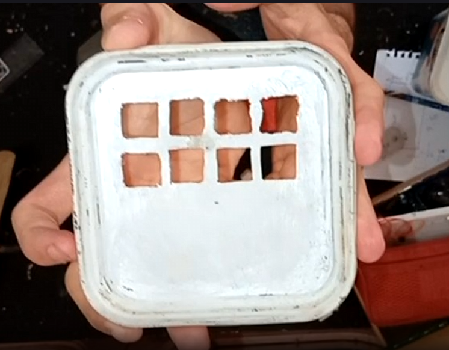

And yeah there was a broken switch that can't be pressed so i just opended it and fixed it. 

And after adding all the switches, i started looking if any square hole needs to be slightly shifted to the left or right so it cannot interrupt the switch next to it.

and after that, i Put all the switches to check again for the last time, and they are all good and well placed.

So, now all the Switches are placed on their places, i need now to make holes for the rotary encoder and the OLED Display.

So i placed them and marked where i will make these places, and then using the Soldering iron, i made a circule hole for the encoder, and a small rectangle for the display pins.

#### Soldering

So after that, i started in the soldering phase.

After i placed all the Switches and OLED and encoder.

I started soldering the matrix, Which was the funniest and awesome part tbh.

I started rounding the diodes legs so i can place them onto the pin i will wire the diode to, and then, i heat it up with the soldering iron and add tin. 

Repeated this for all the swtiches and finished the diodes soldering.

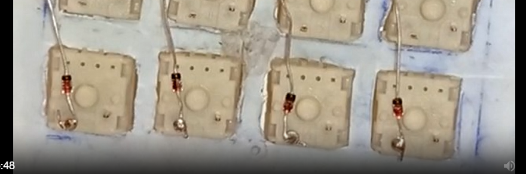

After that, for the Rows, after cutting the legs to be shorter, i used a small tweezers so i can bend the legs so they can be connected to each other and make a row.

After bending them all, i Soldered them with each other, and got 2 rows at the end.

And got this beauty.

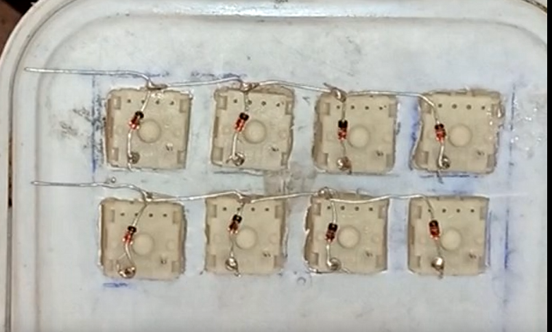

After finishing the rows, i needed to find wires to make the columns, Well i found wires that can be bended so easily, but when i tried to solder them to the Switches. 

It was kinda hard, like they are not made of copper.

So, i searched for another wires that i can use with that, and found a regular copper wires that i can use. 

So i take of the plastic on them on specific areas so i can access the internal copper and rotate it around the pin and then solder it. 

Repeated the same process for all the Columns, and finally finished this beautiful Masterpiece, i loved the handwiring.

And of course used the diode tester in my multimeter, and tested all the switches if they are working.

well, i didn't do that after soldering the matrix but i will write it here as it consider soldering.

I was thinking about a way on how to connect the rotary encoder, as its pins can't be attatched to a jumper.

So, i decided to wire it like the switches to female wires.

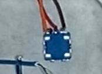

#### Connections

Well, for this one, i don't have much female wires, So i need to use the male wires as female.

So, i noticed that the jumper wrie with the male pin, has a lil gap that another pin can get into it.

So, i tried to bend the jumper's pin, and try to connect it to another pin. 

And guess what, it worked. i connected all the pins fo the Oled in the same way.

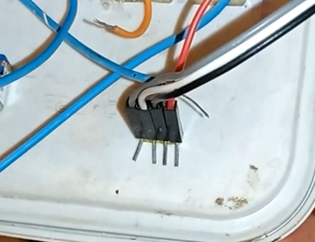

After modding those wires, and connecting them to the display.

When i proceeded to the microcontroller to connect them also there, the microcontroller pins were kinda thicker.

So, i modded the wires more, i took of the black plastic from them, cut the pins, bend the internal metal a lil to make it attach well to the pins.

Like this: 
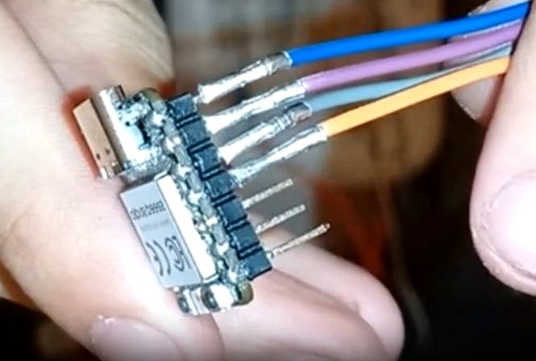

After connecting these wires and connecting all the components to the microcontroller.

And also solder the GNDs and the 5V+s.

#### Testing

I then connected the xiao to my Laptop and then tryed configureing it with POG and it worked, but there was no OLED option in POG, so i tried to write its code myself, but i couldn't, 

So i just ended the Session on the Tested Switches and rotary and RGB, and thought to polish the case in the next session, and after i can search if i can use QMK if it is easier with the OLED.

### Recording Links (6.08 Hours):
- https://lapse.hackclub.com/timelapse/ThuHlQ1luzg-

## Entry 3
- Author: Nader
- Date: 12/07/2026

### Content

This session mainly talk about polishing and how i tried to make it looks better than a cheese box. (at least it is not now a cheese box)

Umm, I also made more than one thing to polish this up.

So let me write the points first:

* Started with covering up all the Box with white paper.
* Drawing all the patterns i will cut into the box.
* Cut them on the first face.
* Made holes for the microcontroller pins instead of using it from the inside the box.
* Didn't like the paper, 'cause it was getting so much dust and sweat from my hands. So removing them
* Trying to remove the company drawings
* made the other Faces patters
* Searched for the QMK Firmware.

Well, let me brick this down.

Um, well for the first thing i made, i thought of instead of scratching the box and remove the drawings.

I just can cover it up with white paper and glue it.

So i already started making that.

I got a white paper and made a chain with them, then i glued it on the box.

Well, it was cool tbh at first. 

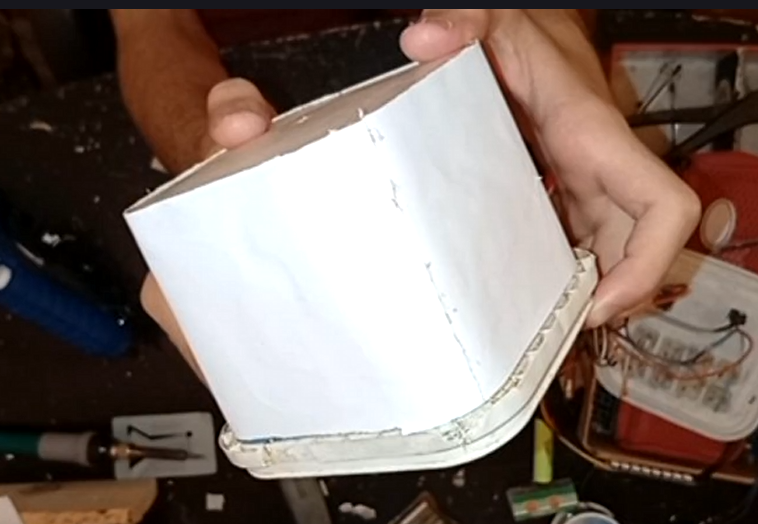

So, i proceeded to the next thing which is making the patterns.

Well, i didn't make it as same as the 3D design exaclty, because it was kinda weak, and i can't make all these holes.

So, i decided to make a diamond shape.

Well, i drew it with my pen on paper. 

And then cut it using my cutter, and got this cool piece.

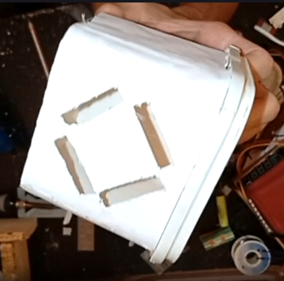

After finishing this face, i got an idea to make the XIAO out of the box on the top cover so i can access it anytime.

but also before making this, i got a white paper, so i can put it on the cover too, and cut a rectangle for the switches and then glued it on the cover.

after this, saddly i disconnected all the wires, and marked its pins places and used the cutter to make a place for it. 

And also used the hot end of my glue gun so i can make a hole for the USB.

And i made it like this.
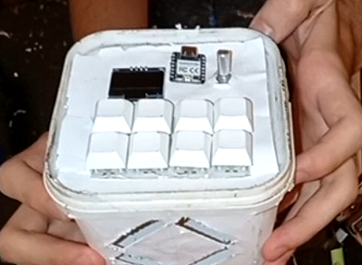

After that i tried to power it on and see how it looks. an tbh, BROO it looks amazinggg.

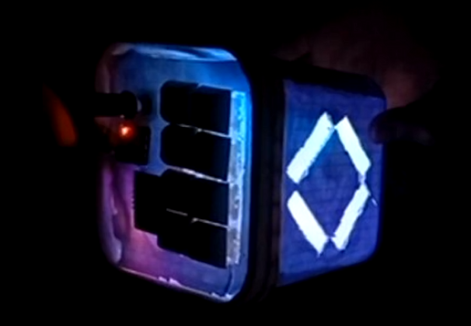

After that, i proceeded to copy the pattern i made, and paste it on the other faces. 

But saddly i remembered that iam in real life, and there is no copy and paste or CTRL + z, and i need to do that manually. :C

So, i started by drawing this on the other faces, and use the same way to make the patterns.

But tbh i saw the white paper while glowing and saw that the lines on the back of this paper are appeared.

So, i decided to remove them and work on removing the drawing by scratching.

And then i finished all the patterns after. (Unfortunattly i cut one by mistake, but it is from the back side so it is ok it won't appear.)

and yeah took this pic after connecting all the wires again.

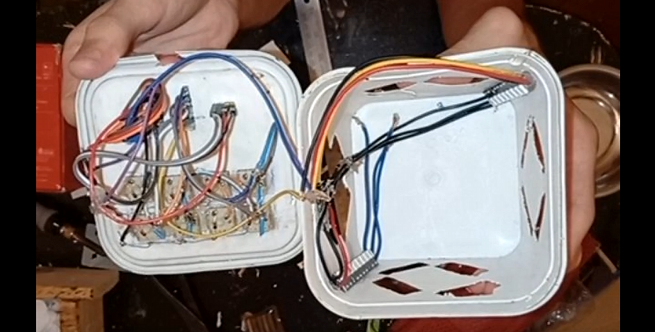

Well, after that. I searched a looooot about the QMK firmware.

Well let me make a section for this.

#### Firmware.

uhhhhh, this part was the baddest.

> [!NOTE]
>First i was afraid that this can consider frauding 'cause i was searching and trying to write code. So I just recorded 30 minutes and closed the rec. but i sit like for another 2 hours only searching about the QMK and searching how to configure it.

Well, i will briefly say what i made for this, Well i hate QMK AND KMK. 

Why? Because these two updated their firmware configuration methods and no one updates the docs for that.

So, tbh i made the AI help me out with that. 

Well, i search a lot about QMK, and hated how the docs are not updated so i decided to delete this shit, and focus on KMK. well, tried a lot to find a software like POG but with support to OLEDs, but i didn't find a stable one.

So, yeah i decided to write my own code myself, and with the help of the AI.

Well, first i opend the Docs of KMK, and found the OLED section and all the modules and extensionss i will use.

And then started writing my keymapings and layers and so on, and every problem i face and the docs don't explain it. I send to Gemini and it tells me based on the Library code itself, not the docs.

I make him read the libirary and write me like a corrected docs.

So i can fix the error i face.

And yeah after finishing that all i made the best project in my life YET.

And yeah iam gonna now record a demo for it and link it in the README.

### Recording Links (5.3 Hours):
- https://lapse.hackclub.com/timelapse/KDBjGGJKgE9H
