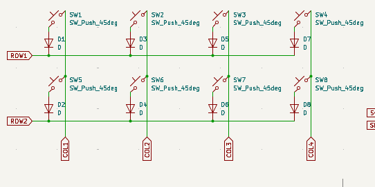
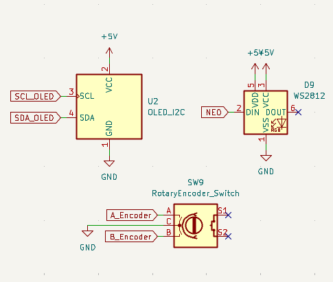
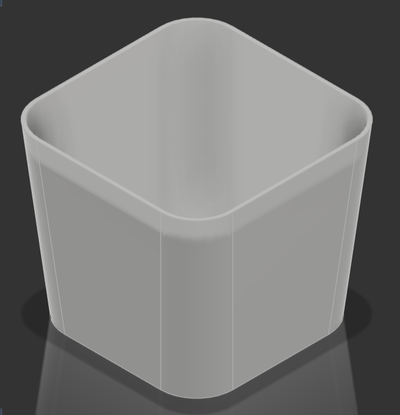
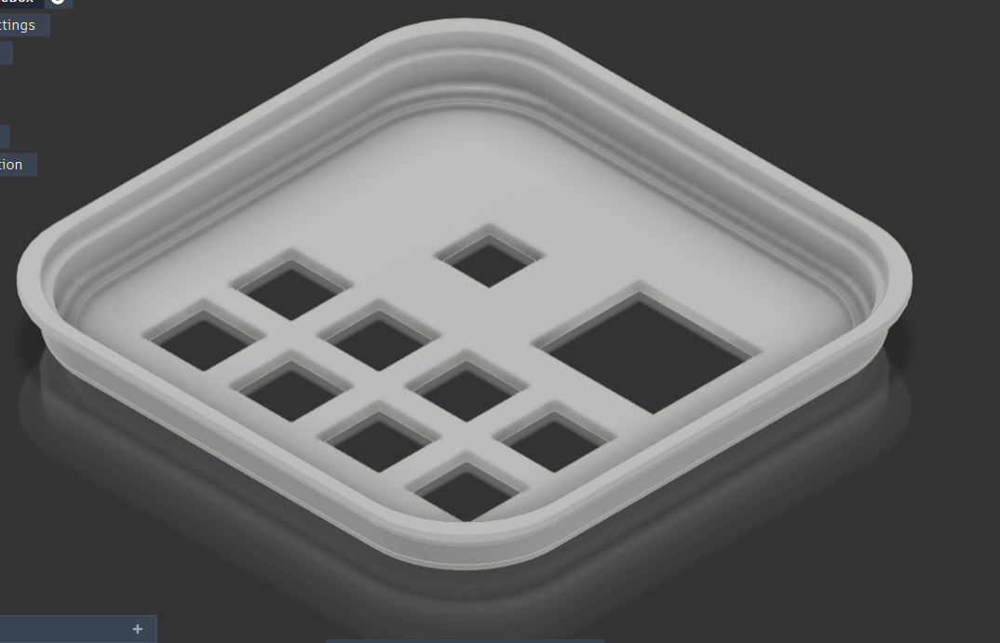
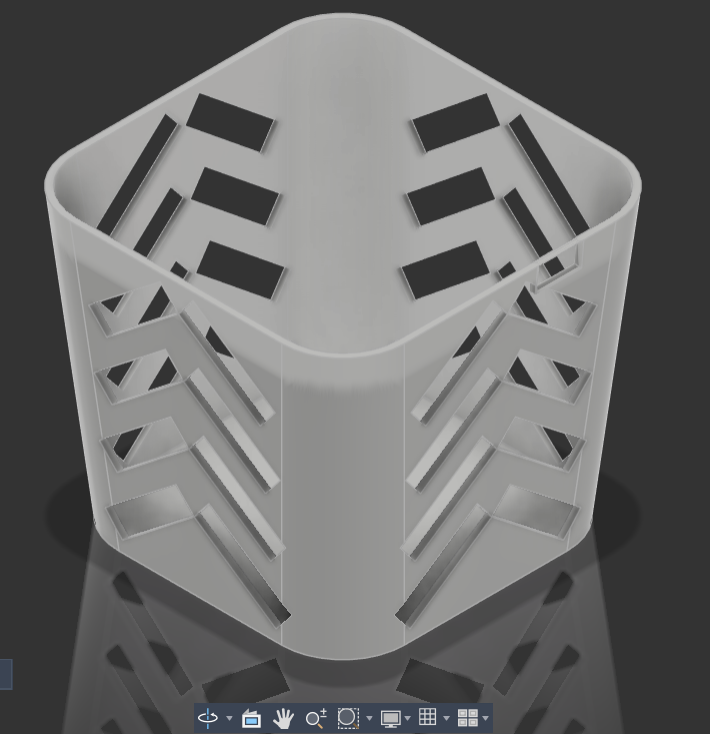
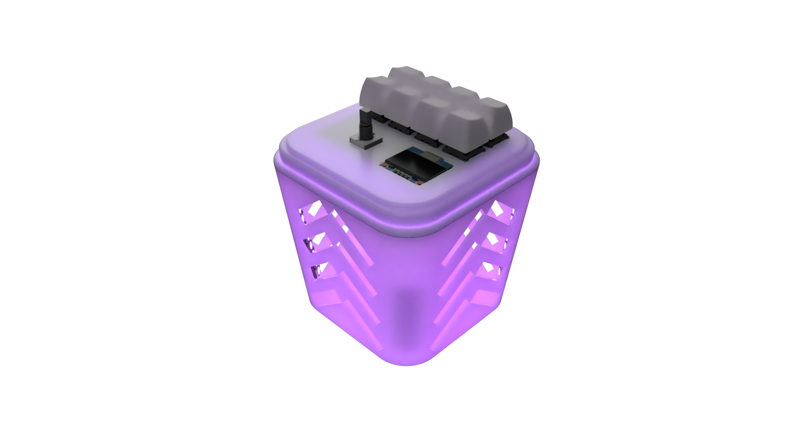

# BoxPad Journal

> [!Note]
> I already made a Macropad before called [SnakePad](https://github.com/Nadoooor/SnakePad), and a workshop in #horizons-equinox. So those designing hours will be kinda few, and also the journal Entrys won't have that much errors i figured out and so on.

## Entry 1
- Author: Nader
- Date: 12/7/2026

### Content

OH well, umm Iam making this project because I want to proof that anyone can start designing and building hardware. Even with very minimal things and DIYing.

So, I decided the most weird thing in my life, Iam gonna make a Cheese box Macropad. 

Yeap as you read. Umm, well iam gonna design PCB and a 3D case for that.
But, this would be like 2 ways to build this. 

* With printables.
    * PCB
    * 3D case
* Without Printables (DIYing)

and iam gonna use the second method to proof what i said above. 

Well, i started in this session with the Designing. 

Umm, i finished the whole design in one session so iam gonna make sections in this Entry.

#### Section 1 (Schematic)

Well, this was the most easy part, bro i was just finished a macropad workshop in #horizons-equinox. 

So, i literaly got all the resources already.

So, i just added the components iam gonna use, i just searched for another Xiao RP2040 symbol to use and downloaded the Xiao offical lib into kicad. 

So after adding my parts which are:

* 8 Switches
* 8 Diodes
* 1 Rotary Encoder
* 1 OLED Display
* 1 Xiao RP2040
* 1 WS2812 Symbol (Just for connections)

I started wiring the matrix first, I wired all the diodes to their Switches and then wired all the ROW switches with each others from the diodes, and wired all the column switches with each other.

So now the Diode oriantation would be COL2ROW. 

After that i added labels to the COLs and ROWs and finished the Switches matrix. 

After finishing the matrix, I proceeded to the WS2812 Neopixels.

I simply wired it to GND and 5v+ and then wired it to a single 1 NEOs label, and then connected this label to pin 6 in the xiao RP2040.

Also did that for the OLED screen, and the rotary encoder. TBH the rotary encoder i forgot how to wire it. so i searched, because i ended up with only 2 pins left for it. 

So i figured out how to wire it, and used these Pins. (THe problem was that i thought i need 3 pins and i can't use GND)

After that, I connected all the labels to the XIAO RP2040. 
And finished the Schematic.

#### Section 2 (PCB)

As I said, I want this project to be made with two ways.

So I will make this simple PCB.

Well, tbh also the PCB was super easy like the Schematic.

Soo, i Assigned the footprints for them. But for the OLED i downloaded a footprint for it as i didn't find one in my footprints.

So, after assigning all the footprints, i added them into the PCB, and started the components placement to find spots for everything.

Umm, after adding every component in its place, I started Tracing all the components with each other, and every component i feel it should have been in another component's place so it can be traced easier, i start swaping these components and change the schematic if needed.

after finishing tracing and grounding with fill zone. 

This is the final result of the PCB.

After finising the PCB, i also added the missing 3D models and also added a 3D model of the keycaps.

#### 3D Design

Well, yeah after finishing the PCB i directly proceeded to the 3D assembly and designing my 3D case. (Which is looks like the Cheese box iam gonna use)

Well, I started with button case, and i took the measurements of the real box.

and made the squeres of this Model and used the Offset plane to make like many layers and then extrude them using the loft tool. 

and using the shell tool, i will make it hollow from the inside.

After that proceeded to the Top Cover. 

This one needed to get the DXF of the keys switches plate. 

and i placed it and then edited in context so i can align it perfectly. 

and yeah i made it with the same planes way as the bottom case.

and also made the rotary and screen holes while iam in context.

after making these two, i started polishing, which didn't take so long 'cause i just added the neosticks and also made some pattern on each side of the bottom case.

After finishing this too, i switched to the rendering workspace.

and gave every thing material, and also gave the neosticks LED material (the material i expolred in SnakeHome).

So, after assigning all the materials. I Proceeded to choose a good environment and nvm i will use the transparent background so i just need environment with good lighting.

So, after configuring this, i took this Rendered pic.

So, yeah that was super cool.

#### Section 3 (Firmware)

After finishing rendering and the 3D, decided to just initally choose the firmware iam gonna use, so i choose KMK at this time, because of the cool POG GUI application i can use. (We will see later that the POG is good but not enough for me)

Well, after picking this firmware, i downloaded all the libs i will use, and also wrote a base code for the keymapings only.

And that's it for this session, i fully finished the Design and iam ready to start DIYing this cheese Box.

(Oh yeah i also made the BOM and searched for the parts, and wrote the README)
### Recording Links (5.16 Hours)
- https://lapse.hackclub.com/timelapse/8QDWHA167W5p

EEntry