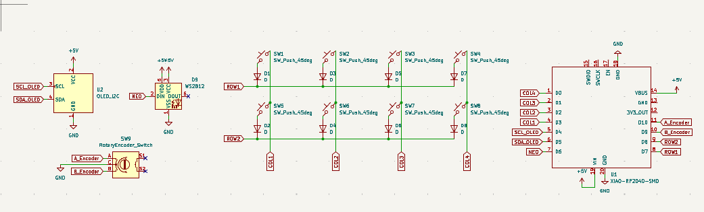
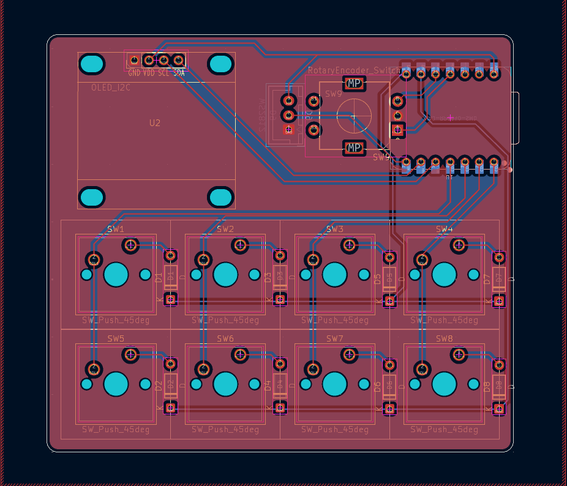
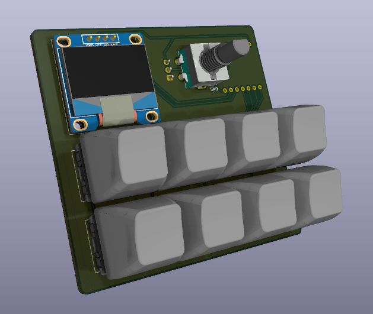

# BoxPad
---------------------

  

-------------------

## Description:
A macropad in a cheese box. This is a macropad made from scratch with MX switches, and it can be totaly made by DIYing (Recycling, and handwiring), or by just printing the case and the PCB.

## Why making this?
Well, I have many hardware components and I want to make something with them, but 3D printing and PCB printing in Egypt costs so much, so gonna DIY it from scratch.

## Features:
- MX switchs in a 2x4 Metrix.
- OLED 0.96' Screen.
- Rotary Encoder.
- NEO sticks.

## Photos:

### Schematic:

### PCB:

### 3D PCB:

### 3D Assembly:

> [!NOTE]
> Here you are the [Fusion Assembly](https://a360.co/4h1u5xi)

## How to Build (Using Printed Parts):

1. Print all your parts.
2. Put the MX Switches in their places on the cover.
3. Solder the screen and the Rotary Encoder.
4. Place the PCB under the switches and Solder them.
5. Solder the XIAO on the board, using its pin header so you can control its height.
6. Solder the JST connector of the NEOsticks 
7. Connect the NEOsticks, and put them inside the case corners.
8. 
